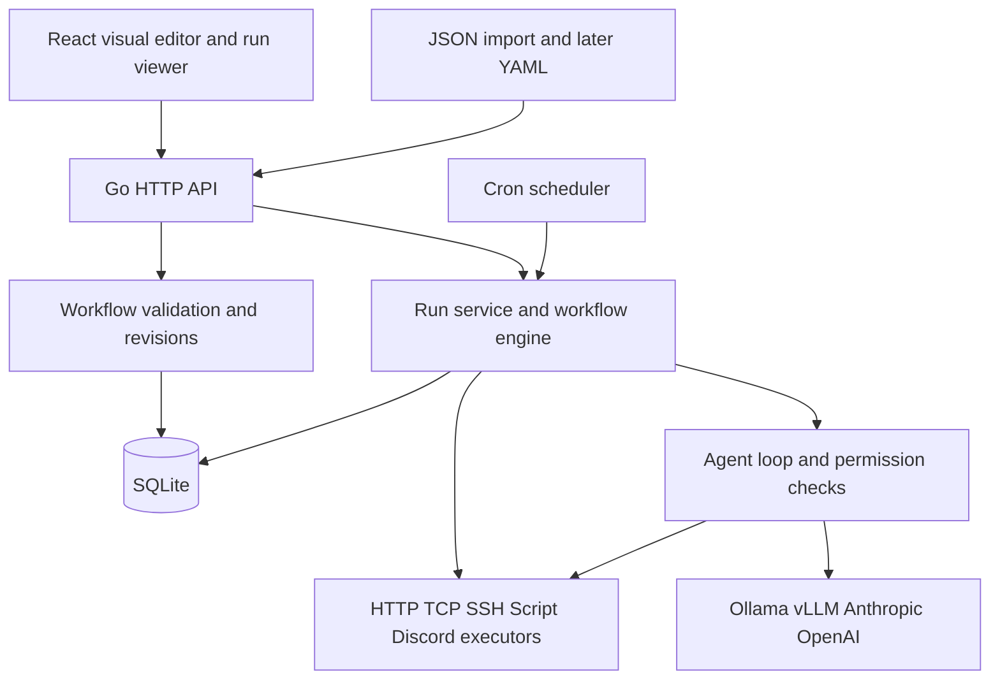

# Patchbay roadmap

Build a self-hosted automation application that lets a homelab administrator connect schedules, service checks, SSH commands, scripts, notifications, and diagnostic agents through a visual workflow editor. The implementation should grow from a small Go/React application that you can explain end to end.

This is the agreed product direction and a proposed implementation plan. The estimates and technical defaults below are planning decisions, not implemented features. Revisit the estimates after completing the first skeleton.

| Constraint | Decision |
| --- | --- |
| Purpose | Personal use, learning Go and concurrency, and an engineering portfolio |
| Time | Approximately seven hours per week; no fixed deadline |
| Development | Linux and macOS |
| Deployment | Docker first; initially one application instance with persistent local storage; optional PostgreSQL and high availability after the local milestones |
| Users | One trusted administrator; sharing is a later expansion |
| Interface | A visual builder for everyday authoring, with a documented machine-readable format |
| Integrations | HTTP/TCP checks, cron schedules, SSH, local scripts, and Discord early |
| Agents | Restricted initially; explicit permissions can expand independently for each agent |
| Model providers | Ollama, vLLM, Anthropic, and OpenAI |
| Offline behavior | The application, schedules, scripts, LAN checks, and LAN SSH continue without internet; external integrations fail visibly and independently |

The first release should support two separate workflows that refer to the same saved server connection:

| Workflow | Trigger | Behavior |
| --- | --- | --- |
| Service monitoring | Every five minutes: `*/5 * * * *` | Check an HTTP health endpoint or TCP port, record health, and notify Discord when the confirmed status changes. |
| Daily server task | Once daily at a user-selected time | Connect over SSH, execute an administrator-configured command, save its output and exit status, and optionally send a summary to Discord. |
| Diagnostic investigation, added next | A new unhealthy incident, or a manual Run action | Ask a configured agent to inspect the incident using permitted diagnostic tools and return evidence and a proposed next step. |

Keep the two schedules independent. Putting a daily operation inside a five-minute workflow creates extra date logic and makes both workflows harder to inspect. The first SSH demonstration can use a harmless diagnostic command such as `uptime`; the administrator selects the real daily task when deploying.

**Use a visual builder first and JSON as the canonical interchange format.** Inside Go, execute typed workflow structures. Serialize those structures as JSON for the API, saved workflow revisions, import/export, and programmatic clients. Keep the application schema independent of React Flow's own UI state.

| Concern | JSON | YAML |
| --- | --- | --- |
| React-to-Go API | Recommended baseline | Adds a conversion step |
| Machine-generated workflows | Recommended baseline | Optional convenience |
| Hand-written configuration | More punctuation | Often easier to scan |
| Script text | Newlines need escaping in raw JSON | Literal blocks support readable multiline text |
| Comments | Use explicit description fields | Supports comments, but preserving them through visual edits requires extra work |

YAML is useful for human editing because it supports comments and literal multiline strings. That does not make it a better internal representation. Its presentation details are separate from its data model. Add YAML import/export after the application schema settles, with equivalent execution behavior but no promise to preserve original comments or formatting. [YAML specification](https://yaml.org/spec/1.2.2/)

For example, these illustrative fragments represent the same configuration:

```json
{"type":"ssh.command","config":{"connectionRef":"lab-server","script":"uptime\ndf -h\n"}}
```

```yaml
type: ssh.command
config:
  connectionRef: lab-server
  script: |
    uptime
    df -h
```

Users should normally edit that script in a multiline field in React, regardless of the serialization format. Agents can use the JSON API. Editable YAML therefore does not need to delay either audience.

When YAML arrives, support a constrained data subset: string keys, ordinary JSON-compatible values, one document, bounded size/depth, and no custom tags or aliases. Reject duplicate keys and unknown fields. The backend must validate imported JSON just as strictly. Keep node positions and viewport settings in a separate `editor` object, preserve layout for matching node IDs, and lay out new nodes automatically. Use an explicit Validate and Apply action for text edits so invalid text never replaces the working definition.

The architecture should remain one deployable Go application with clear package boundaries:



The agent box belongs to a later milestone. Start with normal function calls and small concrete types; introduce interfaces where a second executor or a useful test double establishes the need. Build the workflow engine yourself because dependency scheduling and concurrency are central learning goals. Use established libraries for protocol handling and UI interaction.

| Area | Proposed choice and reason |
| --- | --- |
| Backend | Go, `net/http`, `context`, `log/slog`, and a small explicit dependency setup in `main` |
| Frontend | React, TypeScript, Vite, and React Flow; the graph library supplies selection, dragging, connections, and custom node components |
| Storage | SQLite through `database/sql`, explicit SQL queries, and versioned migrations |
| Scheduling | `robfig/cron/v3` for parsing and time calculations; the application owns admission, overlap, and restart policy |
| SSH | `golang.org/x/crypto/ssh`, verified host keys, saved connections, timeouts, and captured output |
| Scripts | `os/exec`, explicit executable/arguments or an explicit shell script, bounded output, and process cleanup |
| UI updates | Polling in the skeleton; server-sent events for run status and logs when the engine is ready |
| Deployment | A Docker image containing the Go server and built frontend assets; a named volume for application data |

These choices follow the capabilities documented by [React Flow](https://reactflow.dev/learn/customization/custom-nodes), [Go's JSON package](https://pkg.go.dev/encoding/json), [the cron library](https://pkg.go.dev/github.com/robfig/cron/v3), [Go's SSH package](https://pkg.go.dev/golang.org/x/crypto/ssh), and [Go's command execution package](https://pkg.go.dev/os/exec). Pin dependency versions when creating the skeleton; this plan does not require a particular release number.

SQLite fits the initial single-instance application. Use local storage, short transactions, and a deliberate connection policy. WAL can allow readers alongside a writer, but it still permits only one writer at a time and is unsuitable for a shared network filesystem. Never hold a database transaction while waiting on SSH, HTTP, or a model. Test backup and restore using a consistent database backup or a clean shutdown. [SQLite application uses](https://sqlite.org/whentouse.html), [SQLite WAL](https://sqlite.org/wal.html)

Retain SQLite as the simple local deployment option. After milestone 6, first establish safe recovery of interrupted runs on one instance, then add PostgreSQL as an optional backend, and only then consider high availability. A future deployment with multiple instances needs the same authoritative execution state, potentially in a replicated database; it must not share a SQLite file over a network filesystem. The current per-database process lock remains appropriate for local mode. High availability would replace that guard with coordinated ownership and recovery; changing databases alone does not enable it. [SQLite network guidance](https://sqlite.org/useovernet.html)

**Make the workflow contract small and explicit.** A definition contains a schema version, name, one configured trigger, node definitions, connections, and execution settings. Every workflow also supports manual execution. The trigger can appear as a canvas tile while being stored separately from executable steps.

Each node has a stable ID, node type and version, validated configuration, and named inputs. An executor consumes resolved inputs and produces a bounded JSON result plus logs. Save references to credentials, never their values, in workflow files. A node registry owns the mapping from type names to validation and execution. Start with hand-written forms for the small initial node set; generate forms from node schemas only when reusable custom nodes justify it.

Use one JSON result object per node execution. Multiple results may be represented as an explicit array, but the first engine should not automatically execute downstream nodes once per array item. That keeps data flow understandable. Input references can select fields from completed predecessor results. Limit the first condition editor to simple comparisons; add a full expression language only when real workflows require it.

Persist workflow revisions separately from run state. Editing a definition creates a revision, and starting a run fixes the revision and inputs for that run. Snapshot script versions as well. A historical run must remain understandable after a user edits its workflow. An explicit retry can create a new run based on that same snapshot; running the newest definition is a separate action. Credential references resolve against currently configured credentials rather than copying secrets into history.

The initial persistent records should cover workflows/revisions, runs, node attempts, schedules, server connections, and credential references. Add health state and notification delivery records with monitoring. Add agent profiles and tool-call records with agents. Do not create every future table in the skeleton.

The engine must define behavior before adding parallelism:

- Reject cycles, duplicate node IDs, missing references, invalid configurations, and unsupported node versions before admitting a run.
- M0 admits one workflow run across the application and executes its steps sequentially. In M1, replace that global busy gate with bounded admission of concurrent workflow runs, keeping steps sequential within each run. Limit the total active runs and pending queue; expose capacity rejection rather than silently dropping work.
- Keep overlap policy separate from global capacity: by default, skip a scheduled occurrence if the same workflow is already queued or running, and reject a manual duplicate with a visible reason. Different workflows may run concurrently when capacity is available.
- In M3, execute independent ready nodes within each workflow concurrently with global and per-run step limits; initial defaults can be four active steps globally and two per run. These step limits supplement M1's active-run limit.
- For ordinary dependency joins, require all parents to succeed. A failure skips dependent nodes while independent branches may finish; the overall run fails if any required step fails.
- A condition node activates one output branch. Mark the other branch's descendants skipped. Initially reject joins across alternative conditional branches; support ordinary parallel fan-out/fan-in separately. A general merge node is a later feature.
- Represent a failed HTTP/TCP health check as a successful check operation with an `unhealthy` result and a reason. Reserve execution errors for invalid configuration or failure to carry out the operation. A server being unavailable should be actionable workflow data.
- Record run states such as queued, running, succeeded, failed, canceled, and interrupted. Record individual retry attempts without overwriting earlier output.
- Apply deadlines to network and process operations. Canceling a run must stop admission of new steps and request cancellation of active work.
- Default generic SSH/script commands to no automatic retries. Permit retries for selected operations whose repeated execution is acceptable. A retry limit counts attempts consistently and appears in the UI.

In M1, each admitted run owns its sequential execution loop and run state. Synchronize shared admission and history, enforce capacity and same-workflow overlap checks atomically, and retain cancellation and shutdown ownership across all active runs. A submitted background run belongs to the application's lifecycle, so closing the browser or completing the HTTP request must not cancel it.

In M3, extend each active run with a coordinator that owns its mutable dependency-scheduling state. Workers report completion through a channel; they do not all mutate the graph. Preserve M1's bounded run admission, add bounded step execution across runs, and use cancel-aware channel operations. Go's guidance on [pipelines and cancellation](https://go.dev/blog/pipelines) and [context](https://go.dev/blog/context) provides the learning material for these milestones.

The scheduler should enqueue a run through the same run service used by the API. A cron callback should not execute the entire workflow itself. Store an explicit timezone and show upcoming executions. Default monitoring workflows to skip overlapping runs, applying that policy to both scheduled and manual admission. Initially skip missed schedule occurrences after downtime and display the gap. Test daylight-saving transitions; a wall-clock time that does not exist is skipped, and a repeated time follows the chosen cron semantics shown in the preview. Add catch-up policies later. [Cron scheduling documentation](https://pkg.go.dev/github.com/robfig/cron/v3)

On restart, retain completed results and mark formerly running work interrupted. The first bounded-queue increment cancels waiting runs on normal shutdown and marks leftover queued runs interrupted on startup; it does not restore the queue. In a separate follow-up, restore queued runs from their saved workflow snapshots, respecting current capacity and overlap limits. Resume only work recorded as queued and never started. Generic external commands can complete just before the application crashes, and an SSH connection closing does not prove a remote process stopped. Do not automatically repeat an uncertain command. Record that uncertainty and provide deliberate retry controls. Durable automatic resumption of arbitrary external side effects is a later design problem, not an implied first-release guarantee.

Monitoring should have useful behavior beyond sending an alert every five minutes. As an initial default, confirm an outage after two failed checks and recovery after one successful check. Keep the first healthy observation quiet; alert on the first confirmed outage. Store state by workflow/check ID and target, serialize updates, and reset the baseline when the monitored target changes. Explain the resulting detection delay in the UI.

Record a confirmed transition and its notification delivery job in the same database transaction. Deliver notifications independently so an internet outage does not stop LAN monitoring or daily SSH jobs. Use a configurable delivery expiry, initially one hour, and bounded retries; retain expired/failed deliveries in history. A delivery can be duplicated if Discord accepts it just before the application loses confirmation, so give incidents stable identifiers and avoid an exactly-once claim. The initial integration should use a Discord incoming webhook, which supports channel messages without a bot connection. Respect response rate-limit information rather than hard-coding request rates. [Discord webhooks](https://docs.discord.com/developers/platform/webhooks), [Discord rate limits](https://docs.discord.com/developers/topics/rate-limits)

**Treat agents as controlled callers of the same application capabilities.** Start with a bounded loop: supply the incident and permitted tool definitions, receive requested tool calls, validate and authorize each call, execute permitted operations, return results, and stop at a final answer or a limit. The workflow graph remains acyclic; the agent's bounded conversation loop lives inside its node.

| Provider | Planned adapter | Compatibility boundary |
| --- | --- | --- |
| Ollama | Native chat/tool-calling adapter | Verify the selected model supports useful tool calling; local inference requires installed model files. [Ollama docs](https://docs.ollama.com/capabilities/tool-calling) |
| vLLM | Adapter to its supported OpenAI-compatible chat/tool interface | Verify the deployed model, chat template, parser, and server configuration; compatibility is not a promise of every OpenAI feature. [vLLM docs](https://docs.vllm.ai/en/latest/features/tool_calling/) |
| Anthropic | Messages API adapter with application-executed tools | Preserve its tool-use/result message structure inside the adapter. [Anthropic docs](https://platform.claude.com/docs/en/agents-and-tools/tool-use/how-tool-use-works) |
| OpenAI | Responses API adapter with application-executed function tools | Preserve response items, call IDs, and required continuation state inside the adapter. [OpenAI docs](https://developers.openai.com/api/docs/guides/function-calling) |

Build and test one adapter at a time: a deterministic fake first, then Ollama, OpenAI, Anthropic, and vLLM. All four real providers are planned; the order can change to match available hardware and accounts. Keep model IDs configurable and verify a chosen model during integration. Avoid silently moving a conversation between providers. The adapters should expose a small common result shape while retaining provider-specific continuation data; do not force every conversation into a lossy text-only history.

The first agent profile should allow access to a selected server, saved incident details, and a few named diagnostic operations such as uptime, disk usage, and a bounded service-log query. Tool inputs use validated parameters and administrator-defined command templates. The agent does not receive an unrestricted shell, arbitrary SSH destinations, raw credentials, or permission to change its own policy. Log text is evidence to analyze, not authority to grant another tool. Enforce all permissions in Go immediately before execution, including calls made through nested workflows.

Start with a small total tool-call budget, a wall-clock deadline, bounded response sizes, and at most one diagnostic tool executing at a time per agent run. Count all requested calls, including rejected ones, toward the limit. Cloud model requests must only include the diagnostic data selected for that agent; keep secrets out of prompts and apply output filtering before transmission. Redaction is a useful safeguard, not a guarantee that arbitrary logs contain no sensitive data. Keep cloud use explicit, with no automatic cloud fallback for a local agent.

Later, an administrator can grant a particular agent permission to request named repair workflows. An approval should bind to the exact workflow revision, target, and inputs, expire, and be rechecked against current policy when executed. A further opt-in policy can allow selected repair workflows without approval. Broader free-form execution would require a separate execution-isolation design. A label such as “read only” or “trusted agent” is insufficient enforcement.

Docker is the primary installation format. Build the React assets into the application image, include required certificates and timezone data, and keep application state on local persistent storage. Run with the minimum required privileges. The trusted administrator's local scripts execute inside the application container; install their runtimes explicitly and expose selected directories through deliberate mounts. Use SSH to operate the Docker host or other servers. Treat application-container subprocesses as trusted code: starting a process does not sandbox it from the application's files. A later isolated runner can support stronger separation. [Docker container execution](https://docs.docker.com/engine/containers/run/)

Provide single-administrator authentication before using real credentials through a network-accessible UI. Use a maintained authentication approach, appropriate password hashing and session handling, and protection for state-changing browser requests. Keep an encryption key outside the database in a mounted secret, use a standard authenticated-encryption implementation for stored credential values, and document backing up the key with the database. Verify SSH host keys rather than accepting arbitrary hosts. These are directly part of the product's ability to run commands and store credentials; multiuser roles remain later work.

Offline acceptance means the image, required runtimes, and any local model are already installed. With internet access removed but LAN access available, the UI must load without external assets, both schedules must execute, and local/SSH results must persist. Discord and cloud-agent failures should be visible without blocking those operations. A local agent should still work if its inference server and model are available. Installation and model downloads are separate from offline runtime behavior.

Build in the following sequence. Hours include learning, implementation, testing, and brief documentation; they are ranges rather than deadlines.

| Milestone | Deliverable | Effort | At seven hours/week |
| --- | --- | --- | --- |
| 0 | Understandable Go/React skeleton | 14–21 hours | 2–3 weeks |
| 1 | Working cron + checks + SSH + scripts + Discord slice with concurrent workflow runs | 28–49 hours | 4–7 additional weeks |
| 2 | Small visual workflow editor | 21–35 hours | 3–5 additional weeks |
| 3 | Concurrent dependency-node execution within workflows | 21–35 hours | 3–5 additional weeks |
| 4 | Reliable homelab release, v0.1 | 28–49 hours | 4–7 additional weeks |
| 5 | Restricted agents and all four provider targets, v0.2 | 35–63 hours | 5–9 additional weeks |
| 6 | YAML authoring and reusable script nodes | 21–42 hours | 3–6 additional weeks |
| 7 | Safe recovery of interrupted runs on one instance | Scope and estimate after M6 | TBD |
| 8 | Optional PostgreSQL backend and migration from SQLite | Scope and estimate after M7 | TBD |
| 9 | Optional high availability with an active instance and standby | Scope and estimate after M8 | TBD |

Milestones 0–4 total approximately 112–189 hours, or 16–27 weeks. Milestones 0–6 total 168–294 hours, or 24–42 weeks. Milestones 7–9 are later extensions, excluded from those estimates and not required for the local releases; PostgreSQL and high availability remain optional deployment capabilities. Allow additional calendar space for school, unfamiliar tooling, and rework; a 20–30% buffer is reasonable. A useful early homelab demonstration arrives at milestone 1, well before the fuller release. Re-estimate after milestone 0 using your actual pace.

1. **Milestone 0: trace one execution from browser to Go and back.** Create a server, a React page, a versioned sample workflow, a sequential runner, and one HTTP-check executor. Clicking Run creates a run ID and displays the result through polling. An unreachable test service returns a visible unhealthy result; an invalid definition is rejected. Include a small Docker setup and deterministic HTTP fixtures owned by the automated tests. You should be able to explain every package, change a request field yourself, and add a second simple executor with minimal assistance. Keep definitions and runs in memory at this point and document their temporary lifecycle.

2. **Milestone 1: make the project useful with all the core integration types.** Add SQLite, single-admin access, connection/credential configuration, cron admission, TCP checks, SSH and local-script execution, and Discord delivery. Replace M0's application-wide single-run restriction with concurrent workflow runs, a configurable active-run limit, a bounded pending queue, and explicit capacity rejection. Keep nodes sequential within each run. Apply the same admission rules to cron and the API; prevent overlapping queued or active runs of the same workflow by default, while allowing different workflows to run concurrently. Supply the two example workflows as presets with straightforward configuration forms. Use a test SSH server and a local webhook recorder for repeatable development, then test against administrator-selected homelab endpoints. Done means a five-minute health-check workflow can execute while the daily SSH workflow is still running when capacity is available; run limits, queue limits, and same-workflow overlap rules hold under simultaneous start requests; script/SSH output is visible; basic status-change alerts work; and reloading/restarting preserves configuration and completed runs. Verify concurrent admission, history reads, and shutdown with Go's race detector. Full graph editing is the next milestone; users can already configure and run the supported recipes here.

3. **Milestone 2: author the same workflows visually.** Add a node palette, connection handles, node configuration panel, save/validate/run controls, JSON import/export, and a run inspector. Start with linear graphs, then add explicit conditions and ordinary dependency joins with sequential execution. Store editor layout separately. Done means a fresh user can recreate both presets through the UI, save/reload them, and see useful errors for invalid connections. Imported definitions and canvas-authored definitions pass the same backend validation. An active run retains its original revision after an edit.

4. **Milestone 3: learn node concurrency through execution behavior.** Build on M1's concurrent workflow runs by replacing each run's sequential node scheduling with bounded ready-node execution and owned dependency state. Add global and per-run step limits alongside the existing active-run limit. Add user-requested run cancellation, configurable retries, and streamed run updates; extend per-step deadlines and graceful shutdown to parallel nodes. Use a parallel-check workflow and a dependency diamond as demonstrations, including multiple simultaneous workflow runs. Done means active-run, global-step, and per-run-step concurrency never exceed their configured limits, joins wait correctly, retrying a step does not rerun completed siblings, and canceling one run during work or backoff leaves no permanently blocked run or canceled sibling workflow. Exercise the concurrency paths with Go's race detector; a passing race run is evidence for the exercised paths, not proof that no race can exist. [Go race detector](https://go.dev/doc/articles/race_detector)

5. **Milestone 4: make unattended behavior explicit and ship v0.1.** Finish monitoring thresholds, persisted notification delivery, restart reconciliation, schedule overlap/duplicate-admission handling, consistent backups, retention limits, and resource bounds. Persist scheduled occurrence identifiers so a duplicate enqueue cannot create two internal runs for the same occurrence. Confirm that process cancellation handles the local process tree on the supported platform, and surface uncertain remote completion. Done means the offline scenario passes, an application restart does not silently repeat an uncertain SSH action, failed notifications are inspectable, backup/restore works, and a documented Docker installation can run the two example workflows for a seven-day homelab trial.

6. **Milestone 5: add restricted diagnostic agents and ship v0.2.** Build the tool loop and permission checks against a fake provider before connecting real models. Add the provider adapters, per-agent configuration, tool traces, evidence-linked findings, cancellation, and limits. Done means each supported provider completes the same small diagnostic contract when configured with a suitable model; requests for a forbidden host, undeclared tool, modified command, or self-granted permission are refused by the backend. A provider outage ends the agent attempt cleanly while ordinary monitoring continues. The initial agent recommends repairs; controlled execution of approved repair workflows is a later extension.

7. **Milestone 6: make technical extension comfortable.** Add YAML import/export and Validate/Apply authoring, then reusable script nodes with input/output schemas, descriptions, versions, and generated configuration forms. A trusted administrator can edit a script inside the app and expose it as a reusable node. Define a small process protocol: bounded JSON input on stdin, one structured JSON result on stdout, and logs on stderr. Pin the script/runtime choice in each node revision. Done means a new diagnostic script becomes a reusable visual node, and JSON/YAML/visual definitions have equivalent execution behavior. Prefer this process boundary over native dynamically loaded Go plugins, whose toolchain and portability constraints complicate distribution. [Go plugin documentation](https://pkg.go.dev/plugin)

8. **Milestone 7: recover interrupted runs safely on one instance.** Extend the earlier restoration of queued, never-started runs to recovery of partially completed workflows. Persist enough state to reconstruct the original workflow/script revisions, inputs, completed outputs, and individual node attempts. Recover at node boundaries; resuming inside a node requires that node's explicit checkpoint support. Define recovery policy per node: retry only when repetition is safe or the destination enforces duplicate prevention; leave uncertain SSH/script/notification outcomes visible for deliberate review. Done means crash tests before an action, after its external effect, and around saving its result preserve confirmed completed steps and enforce each node's recovery policy without promising exactly-once side effects. Verify this with SQLite before introducing multiple instances. [Workflow retry and idempotency example](https://docs.temporal.io/activity-definition#idempotency)

9. **Milestone 8: add PostgreSQL as an optional storage backend.** Keep SQLite as the default for local installations. Introduce the storage interfaces actually needed by the second backend, with explicit queries and versioned migrations for each. Initially retain one executing application instance per database, using a PostgreSQL ownership guard rather than a local file lock. Provide a deliberate migration procedure with writes stopped, validation, and a retained SQLite backup; preserve IDs, workflow revisions, run/attempt history, schedules, and credential access, including the separately backed-up encryption key. Done means both backends pass the same persistence and M7 recovery contract tests, migration and backup/restore are demonstrated, and a PostgreSQL disconnect stops new dispatch until ownership is re-established while uncertain in-flight work follows its recovery policy. This milestone adds storage choice; failover remains M9.

10. **Milestone 9: evaluate optional high availability with an active instance and standby.** Begin with one instance owning scheduling and execution while another is ready to take over, using the same authoritative PostgreSQL state. Acquire ownership atomically, renew an expiring lease, and enforce an ownership generation on state changes so an old owner cannot overwrite the new owner's progress. Stop dispatch when ownership cannot be renewed; lease expiry does not prove an old executor or external command has stopped, so M7 recovery rules still apply. Coordinate schedule admission and run limits, route requests to the active instance, and make required credentials, encryption keys, node versions, runtimes, and referenced files available to the standby. Include database replication/failover in the deployment design and state the acceptable takeover delay and potential data loss; application redundancy alone is insufficient. Done means tests of process/host failure, network partitions, a paused former owner returning, and database failover demonstrate ownership enforcement and policy-controlled recovery without automatically repeating uncertain effects. Keep simultaneous execution by multiple application instances as a separate future extension. [PostgreSQL standby documentation](https://www.postgresql.org/docs/current/warm-standby.html)

The initial skeleton can fit this layout; add packages as their milestones introduce real behavior:

```text
cmd/server/main.go         Construct dependencies and start/shut down the app
internal/workflow/        Workflow, node, run types and validation
internal/engine/          Sequential execution first; concurrency later
internal/nodes/           HTTP executor first; other integrations next
internal/httpapi/         Request parsing and response mapping
web/                      React application
workflows/                Normal workflow definitions
examples/                 Workflow templates for user-configured services
```

Add `internal/store` and `internal/scheduler` in milestone 1. Add `internal/agent` when agents begin. Keep monitoring state in a focused service when its transaction rules develop. Start with a constructor per component and explicit dependencies; split packages when ownership becomes clearer, not to populate an architecture diagram.

The first API surface can be `GET /api/workflows`, `POST /api/workflows/{id}/runs`, and `GET /api/runs/{id}`. The run response should contain state, timestamps, step results, and actionable errors. Add authoring, credentials, schedule configuration, cancellation, and event-stream endpoints only in their respective milestones. The browser must never execute workflow nodes itself.

For a seven-hour week, plan two two-hour implementation sessions, one two-hour integration/test session, and one hour for reading and notes. Make each session end with a runnable result or a clearly recorded failing case. Use assistance for setup, explanations, review, and bounded examples; personally implement at least the scheduler's ready-node logic, cancellation ownership, and a new node. Before moving on, explain what owns the state, what can run concurrently, and what happens on failure.

The first two or three weeks should follow this order: define the smallest workflow and run types; implement and test one HTTP executor; call it through a sequential runner; expose start/status endpoints; connect the React Run button; package the result in Docker; then walk through success, unreachable service, and invalid configuration. This is the skeleton handoff boundary. SQLite, SSH, and schedules follow once that execution path is understandable.

Verification should focus on behavior that makes the application trustworthy:

| Scenario | Evidence to capture |
| --- | --- |
| Invalid or cyclic graph | Run refused with a useful validation error |
| Concurrent workflows (M1) | Health checks progress during a long SSH run when capacity is available; active runs and the pending queue remain bounded; nodes stay sequential within each run |
| Simultaneous admission and overlap (M1) | Cron and manual starts share atomic admission checks; duplicates of a queued or running workflow are skipped or rejected visibly; capacity rejection is explicit |
| Parallel dependency graph (M3) | Correct ordering, joins, and output bindings; global and per-run step limits hold across simultaneous workflows |
| Cancellation during execution or retry | No new steps start; active operations terminate or report uncertain remote completion |
| Repeated unhealthy checks | One incident transition rather than repeated alerts every interval |
| Internet unavailable | LAN checks, scripts, SSH, UI, and history continue |
| Restart around an external operation | Completed records preserved; ambiguous work not automatically repeated |
| Slow or disconnected UI client | Workflow progress continues; event/log buffers remain bounded |
| Agent asks for a forbidden action | Backend rejects it regardless of the model's justification |
| YAML/JSON import and visual edit | Same validated execution model; no silent field loss |
| Backup/restore | Definitions, schedules, history, and credential access recover together |
| Partial-run recovery (M7) | Confirmed completed steps are preserved; safe attempts recover; uncertain external effects remain visible and require their configured recovery policy |
| PostgreSQL option and migration (M8) | Both backends satisfy the persistence/recovery contract; migration preserves identity and history; backup/restore and database disconnection behavior are verified |
| Optional high availability (M9) | A standby takes over under enforced ownership; stale owners cannot overwrite progress; partition and database-failover tests respect recovery policy and documented recovery objectives |

Use Go unit tests for graph/state rules, fake clocks for scheduling and backoff, local HTTP/SSH fixtures for integration tests, and a few browser tests for create/save/run/inspect. Do not depend on live Discord or paid model calls for routine tests. Add opt-in provider smoke tests and report honestly which providers were tested live versus through fixtures. Test output limits and shutdown behavior with deliberately slow and noisy tasks.

The portfolio should demonstrate the engineering decisions through observable behavior: a three-minute video showing workflow creation, an induced outage, a Discord transition alert, a daily SSH result, and a restricted agent's diagnosis; a short architecture explanation; and a repeatable benchmark of scheduling delay and resource use on recorded hardware. Report measured numbers only. A possible eventual résumé bullet is: “Built a self-hosted workflow automation platform in Go and React with bounded concurrent DAG execution, durable run history, scheduled SSH tasks, and configurable diagnostic agents.” Adjust that statement to the features actually completed.

Save short decision notes as you build: why one process and SQLite fit the first deployment; how the graph scheduler owns state; why workflow snapshots matter; what cancellation means for local versus remote work; and how permissions remain independent of the model provider. Those explanations support both your learning and architecture interviews.

Keep PostgreSQL and optional high availability outside the first local releases, following the M7–M9 dependency order above. Multiuser permissions, distributed workers, marketplace distribution, arbitrary nested loops, untrusted-code sandboxing, and unrestricted autonomous repairs remain separate later possibilities. Automatic repetition of uncertain external side effects is not a general recovery guarantee, including in an HA deployment. The near-term result is a useful homelab application with a small understandable core and a clear route to the larger system you want to build.
